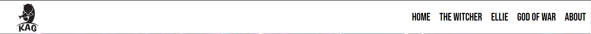
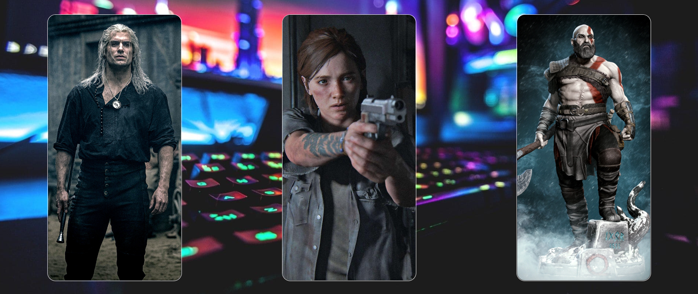
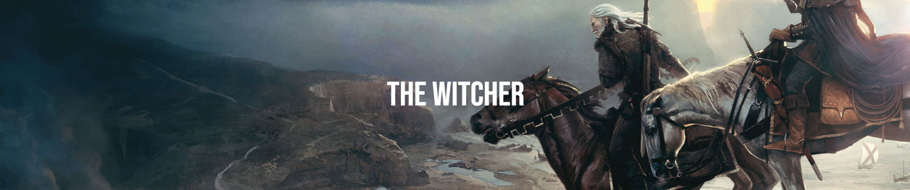
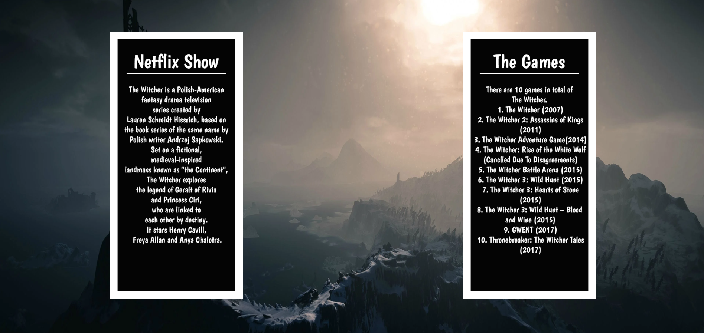

# Know All Gamestop

Welcome.

This website is called "Know All Gamestop" it is a place where courious new games can stop by and inform themselves about a certain character they have recently came across while gaming. This website would be extreamily useful for young people learning about gaming and all ages that have recently took gaming as a hobbie on board.

# Features On Home Page

## The Landing Page Image

I made this the Landing Image as it makes the overall website central. The comforting message "Get All Your Information Right Here" portrays a good relationship between the user and the developer (Me). The user gets the impression that this website is simple and easy to use.

## Navigation Bar

Featured on all six pages, the full responsive navigation bar includes links to the Gearlt, Ellie, Kratos and About.

## Interatcion Section

This section has three images that portaray the available pages for the user to view. The three images are also clickable the same as the navigation bar.

## Footer

This is showed at the bottom of every page on this website with the addition of the Contact Page

# Gearlt (The Witcher) Page

## The Landing Page Image

This image is a Cinematic scene in the Game.

## About The Witcher

This section is the main purpose of the website, it gives a breif discription of "The Witcher". This simplistic design enables the user to get the information about the character whilst not being overwhelmed by an enormous amout of information.

## YouTube Video

This section is to give the user a breif video which enables the user to get more information on the character.

# Ellie Page

## The Landing Page Image

This image is from the home page, I made this the Landing Image as it make the overall website easier to navigate.

## Navigation Bar

The Navigation bar in the page "Ellie" is shortened to make a more simplistic design and easy navigation.

## Interatcion Section

This section has three images of the character for the user to view.

## About Ellie

This section is the main purpose of the website, it gives a breif discription of "Ellie". This simplistic design enables the user to get the information about the character whilst not being overwhelmed by an enormous amout of information.

## YouTube Video

This section is to give the user a breif video which enables the user to get more information on the character.

# Kratos Page

[Kratos Page](https://seangrant18.github.io/Website/Know-all-gamestop-kratos.html)

## The Landing Page Image

This image is from the home page, I made this the Landing Image as it make the overall website easier to navigate.

## Navigation Bar

The Navigation bar in the page "Kratos" is shortened to make a more simplistic design and easy navigation.

## Interatcion Section

This section has three images of the character for the user to view.

## About Kratos

This section is the main purpose of the website, it gives a breif discription of "Kratos". This simplistic design enables the user to get the information about the character whilst not being overwhelmed by an enormous amout of information.

## YouTube Video

This section is to give the user a breif video which enables the user to get more information on the character.

# Testing

I have taken great lengths for testing this website from testing:
* The Responsive Desgin
* Resizing The YouTube Video To Match The Viewport
* Making Sure The Images Fit My Desired Design

## Bugs
Throughout testing i have come across some stobern bugs such as:
* Content Of The Navigation Bar Not Fitting Mobile Viewports
* The "Gearlt Page" Was Displaying As Half The Actual Width In Chrome Developer Mode
* The "Gearlt Page" Landing Page Was Not Fitting Correctly This Let Me To Restart The Page All Over

## Validator Testing
HTML
* No errors were returned when passing through the official [W3C Validator](https://validator.w3.org/nu/#textarea)
CSS
* No errors were found when passing through the official [(Jigsaw) validator](https://jigsaw.w3.org/css-validator/validator)

# Deployment
The site was deployed to GitHub pages. The steps to deploy are as follows:
* In the GitHub repository, navigate to the Settings tab
* From the source section drop-down menu, select the Master Branch
* Once the master branch has been selected, the page will be automatically refreshed with a detailed ribbon display to indicate the successful deployment.

The live link can be found here - https://seangrant18.github.io/Website/

## Content
* Landing page Header was taken from the Code Institute Coders coffeehouse Website
* Instructions on how to implement the YouTube elements was taken from [W3Schools](https://www.w3schools.com/html/default.asp)
* Font was taken from [Google Fonts](https://fonts.google.com/)

## Media
* All images were taken from Google Images